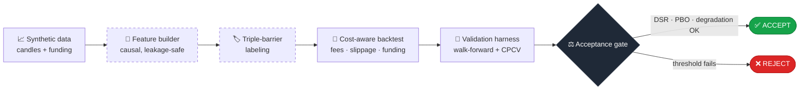

<div align="center">

# crypto-backtest-lab

**An offline, cost-aware backtest & overfitting-validation lab for crypto perpetual-futures strategies.**

Runs end to end on synthetic data — no API keys, no venue, no network.
One command builds features, labels them, backtests through a realistic cost model,
and reports the statistics that tell you whether a backtest is *trustworthy* or just *lucky*.


</div>

---

## Why it exists

Most retail backtests lie. They report a beautiful Sharpe ratio that evaporates the
moment real fees, funding, and slippage are applied — or that was quietly cherry-picked
from hundreds of variations. This project is built around the opposite discipline: a
backtest you can *trust*, measured by three numbers that are hard to fool, and a
validation pipeline engineered to refuse to leak the future into the past.

## The pipeline



The feature and labeling stages (dashed) are **causal and leakage-controlled**:
rolling/trailing transforms only, with microstructure aligned by a backward as-of join on
each bar's *close* time. The validation harness adds **purge + embargo** across every
train/test boundary, so a label's future horizon never leaks into its training set.

## It works in both directions

A backtest harness is only honest if it can do two things: **reject noise** and
**accept a real edge**. This one does both, and you can see it in one command each.

<table>
<tr>
<th>❌ Random signals → <code>--synthetic</code></th>
<th>✅ Planted edge → <code>--planted-edge</code></th>
</tr>
<tr>
<td>

```text
THE THREE TRUST NUMBERS
  1. Deflated Sharpe (DSR):  0.001
  2. Prob. Backtest Overfit: 0.155
  3. IS -> OOS degradation: -132.6%

  out-of-sample Sharpe:      0.27
----------------------------------
acceptance gate:           FAIL
  - OOS Sharpe 0.27 < 0.8
```

The demo signals carry no edge, and the
harness *correctly refuses* them.

</td>
<td>

```text
THE THREE TRUST NUMBERS
  1. Deflated Sharpe (DSR):  1.000
  2. Prob. Backtest Overfit: 0.000
  3. IS -> OOS degradation:   3.9%

  out-of-sample Sharpe:     71.28
----------------------------------
acceptance gate:           PASS
```

A deliberately planted teaching edge —
all three numbers good, gate passes.

</td>
</tr>
</table>

> The planted edge is a hand-injected, slowly-switching momentum regime — a teaching
> device, clearly labelled in the code and the run log. Its cartoonish Sharpe is the
> giveaway: it is **not** market structure and means nothing beyond this synthetic series.

## What it demonstrates

- **Leakage-safe feature engineering** — every transform is causal; microstructure
  (funding, open interest, basis) is aligned to each bar with a backward as-of join on
  the bar's *close* time. Enforced by `tests/test_no_leakage.py`, which asserts the
  feature row at time *t* is byte-identical whether computed on data up to *t* or on the
  full series.
- **Triple-barrier labeling** (López de Prado) — volatility-scaled take-profit /
  stop-loss / time barriers, vectorized, returning each label's exit index for purging.
- **A realistic cost model** — maker/taker fees, slippage, and the part most backtesters
  skip: **funding**, layered onto every bar via the vectorbt engine.
- **Purged, embargoed validation** — walk-forward and **Combinatorial Purged
  Cross-Validation (CPCV)** that kill label-overlap leakage across the train/test boundary.
- **The three trust numbers**, implemented from their original papers (see
  [`docs/METHODOLOGY.md`](docs/METHODOLOGY.md)): the **Deflated Sharpe Ratio**, the
  **Probability of Backtest Overfitting** via CSCV, and **IS→OOS degradation** — using
  only numpy/pandas and the standard library (no scipy, no AGPL dependency).
- **Config-driven, no magic numbers** — every fee, threshold, and window is read from
  `config/settings.yaml` through a typed pydantic loader.

## Quick start

Requires [uv](https://docs.astral.sh/uv) and Python 3.12 (uv installs it for you).

```bash
uv sync

uv run python scripts/run_backtest.py --synthetic       # noise     -> gate FAILS (correct)
uv run python scripts/run_backtest.py --planted-edge     # real edge -> gate PASSES
uv run pytest -q                                         # 25 tests
```

`run_backtest.py` generates a synthetic data lake on first run (a seeded geometric random
walk with volatility clustering and mean-reverting funding — clearly labelled, not market
data), then runs the full pipeline and prints the report.

## Layout

```
cbt_lab/
  config.py              # typed settings loader (pydantic)
  data/
    synthetic.py         # seeded synthetic candles + funding (offline data source)
    collectors.py        # parquet lake paths + interval helpers
    microstructure.py    # funding / open-interest / basis features (causal)
  features/
    indicators.py        # technical indicators (causal)
    builder.py           # assembles the leakage-safe feature matrix
  labeling/
    triple_barrier.py    # volatility-scaled triple-barrier labels
  backtest/
    costs.py             # fees, slippage, funding cost model
    engine.py            # vectorbt engine: target position -> net returns
  validation/
    walk_forward.py      # purged + embargoed walk-forward splits
    cpcv.py              # combinatorial purged cross-validation
    metrics.py           # DSR, PBO (CSCV), IS->OOS degradation
config/settings.yaml     # every number the pipeline uses
scripts/run_backtest.py  # end-to-end entry point
tests/                   # incl. test_no_leakage.py
```

## A note on scope

This is a self-contained portfolio project: research **infrastructure**, not a trading
system. The "strategies" it runs (a funding fade, a momentum follow, a Bollinger
mean-reversion) are throwaway demonstration signals defined inside `run_backtest.py`, with
no real edge. The value here is the plumbing and the validation discipline. Nothing in this
repository is financial advice.

## License

[MIT](LICENSE).
